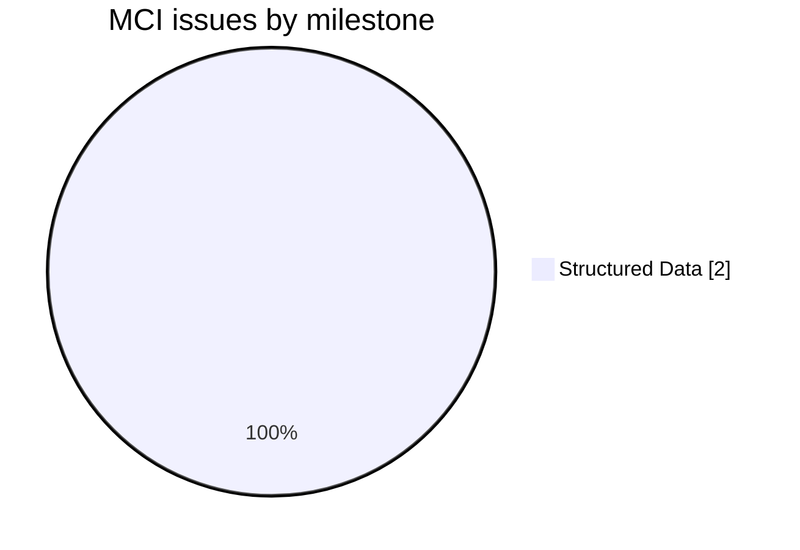
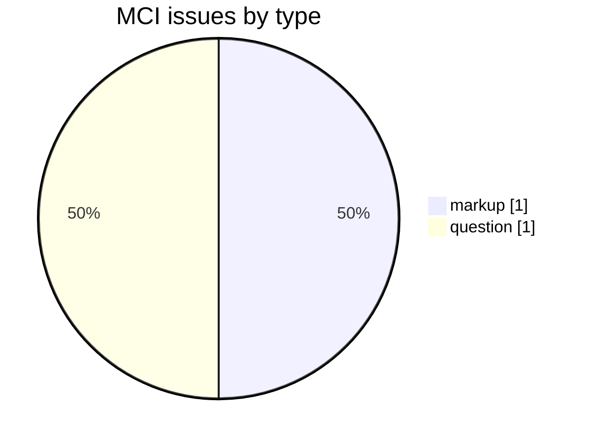
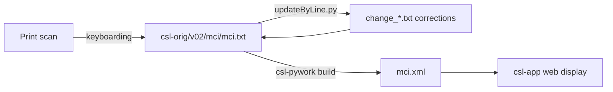

# MCI — *Mahābhārata Cultural Index* (1976–1993)

Development and correction repository for **the *Mahābhārata Cultural Index* (A. D. Pusalker et al.)**, a specialized cultural and onomastic index to the Mahābhārata, part of the [Cologne Digital Sanskrit Lexicon](https://www.sanskrit-lexicon.uni-koeln.de/) (CDSL). The canonical source text lives in [`csl-orig/v02/mci/mci.txt`](https://github.com/sanskrit-lexicon/csl-orig/blob/master/v02/mci/mci.txt) (2,325 index entries); this repository holds the development, correction, and enrichment work.

A partial, still-growing index of names and cultural references in the Mahābhārata rather than a general dictionary.

## Documentation

- [CLAUDE.md](CLAUDE.md) — repository guide and data-format reference.
- [DATA_DICTIONARY.md](DATA_DICTIONARY.md) — markup tag reference.
- [CONTRIBUTING.md](CONTRIBUTING.md) · [CODE_OF_CONDUCT.md](CODE_OF_CONDUCT.md)
- [prefaces/README.md](prefaces/README.md) — front-matter OCR + EN/RU translations (see below).

## Front matter (`prefaces/`)

The dictionary's **front matter** has been OCR'd from the Cologne csldoc scans into faithful Markdown, with a Russian translation of every page and consolidated single-file editions.

- **Source language: English** (Sanskrit terms in IAST kept verbatim). Because the base text is English, there is **no `.en.md`**; only `.ru.md` translations are added. Consolidated editions: [`prefaces/mcipref_all.en.md`](prefaces/mcipref_all.en.md) (source) and [`prefaces/mcipref_all.ru.md`](prefaces/mcipref_all.ru.md) (Russian).
- **Cologne source:** [mcipref.html](https://sanskrit-lexicon.uni-koeln.de/scans/csldev/csldoc/build/dictionaries/prefaces/mcipref.html) — 28 scans (Vol. 1 Fasc. 1–4 + Vol. 2 Fasc. 1–4 title/contents pages, plus the Vol. 1 Fasc. 1 Foreword + Editor's Preface).
- **File conventions:** `mciprefNN.md` (English OCR), `mciprefNN.ru.md` (Russian), `scans/mci_0000-XX.jpg` (source scans). Digitizer/library stamps (Bonn *Indologisches Seminar*, Heidelberg *Südasien-Institut* inventory marks, running headers/footers) are omitted as not part of the original.
- **Signatures/dates found:** Foreword (p. vii) signed **R. N. Dandekar**, BORI Poona, **25 May 1993**; Editor's Preface (p. VIII) signed **M. A. Mehendale**.
- **⚠ Source-metadata note:** the scanned title pages and [`csl-orig/v02/mci/mciheader.xml`](https://github.com/sanskrit-lexicon/csl-orig/blob/master/v02/mci/mciheader.xml) both give the editor as **M. A. Mehendale** and the publisher as the **Bhandarkar Oriental Research Institute, Poona / Pune** (Vol. 1 Fasc. 1, 1993 → Vol. 2 Fasc. 4, 2007). This differs from the "A. D. Pusalker … Bharatiya Vidya Bhavan, Bombay, 1976–1993" attribution in the **Source** section below — the latter appears to be a separate/catalog confusion and should be reconciled against the front matter.

<strong>OCR run notes (2026-06-23)</strong> — cost, timing, and technical lessons

Produced by the `/cologne-preface-ocr` skill (vision OCR + translation), run synchronously on the main thread (no subagents) per the preface-retry rules, after the Cologne host had recovered from an IP-level throttle. Process retrospective, not part of the deliverable.

**Cost.** Main thread only (no subagents): 28 pages OCR'd from native-resolution crops (≈70 crop-reads at ≤1700 px), 28 English source pages + 28 Russian translations written incrementally, plus scan discovery/downloads. Estimated **≈0.9–1.1 M tokens** total.

**Time.** Scans downloaded one at a time in 4 gentle batches (foreground curl + retry-on-empty + 2 s sleeps) to stay friendly to the just-recovered host; one scan (`mci_0000-16.jpg`) arrived truncated and was re-fetched. OCR + translation interleaved with downloads.

**Technical lessons (reusable):**
1. MCI csldoc scans are **`.jpg`, not `.png`** (skill assumes png) — grep the `` ref for `.jpg`.
2. Sub-page → scan mapping is **not 1:1**: page 01 = `mci_0000-01`, then offset jumps (02 = `-03`, 16 = `-19`, 28 = `-43`). Each toctree sub-page embeds exactly ONE scan (the recto leaf); always read the filename from each `mciprefNN.html`, never assume sequential.
3. The substantive front matter is all in **Vol. 1 Fasc. 1**; the other 26 scans are short per-fascicule title + contents pages.
4. Scans are modest resolution (2128/2484 px wide, >1900 tall) → band vertically, downscale full-width crops to ≤1700 px; legible despite the throttle.
5. Always integrity-check JPGs with `PIL.Image.load()` after download — a 200 response can still be a truncated file; re-fetch.

## Timeline

| Period | Activity |
|---|---|
| 2014 | Repository activity begins (first tracked issues) |
| 2026-05 | Issue taxonomy, citation metadata, documentation |
| 2026-06 | Front-matter OCR + EN/RU translation of the prefaces (`prefaces/`) |

## Projects & Milestones

| Milestone | Open | Closed | Total |
|---|---|---|---|
| Dictionary to Book | 0 | 0 | 0 |
| Digitization Quality | 0 | 0 | 0 |
| Structured Data | 1 | 1 | 2 |
| Major Enhancements | 0 | 0 | 0 |
| **Total** | **1** | **1** | **2** |

## Issues

### Open

| # | Title | Type | Severity | Milestone |
|---|---|---|---|---|
| 1 | Printed Book Categories Lost in OCR? | question | minor | Structured Data |

### Solved

| # | Title | Type | Severity | Milestone |
|---|---|---|---|---|
| 2 | [markup] Minor mci.txt Markup Oddities | markup | minor | Structured Data |

## Labels

### Type labels

| Label | Meaning |
|---|---|
| `link-target` | Click-throughs from `<ls>` abbreviations to scanned PDF pages |
| `link-splitting` | Splitting combined `SOURCE N,N` refs into per-page links |
| `markup` | Normalising XML tag content |
| `text-correction` | Corrections to English/Sanskrit definitions or headwords |
| `content-enhancement` | New material or structural additions beyond correction |
| `encoding` | SLP1/IAST transcoding, character normalisation |
| `scan-quality` | Replacing blurry/skewed/missing scan pages |
| `bug` | Broken links, XML errors, broken downloads |
| `question` | Scholarly questions requiring research |

### Severity labels

| Label | Meaning |
|---|---|
| `minor` | Targeted fix — a handful of lines or a single file |
| `medium` | Standard unit of work — one batch of corrections |
| `hard` | Large effort spanning many sources or files |

## Contributors

| Contributor | Commits |
|---|---|
| gasyoun (Mārcis Gasūns) | 8 |

## Source

- **Author**: Pusalker, A. D. (and others)
- **Title**: *Mahābhārata Cultural Index*
- **Place / Publisher**: Bombay: Bharatiya Vidya Bhavan
- **Year(s)**: 1976–1993
- **Volumes**: ongoing series
- **Language pair**: Sanskrit (cultural index)
- **Size (CDSL headword index)**: 2,325 index entries
- **License (digital edition)**: CC BY-SA 4.0
- See [CITATION.cff](CITATION.cff) for machine-readable citation.

> **Note:** the OCR'd front matter (see [`prefaces/`](prefaces/)) and `csl-orig/v02/mci/mciheader.xml` attribute the work to **M. A. Mehendale (ed.), Bhandarkar Oriental Research Institute, Poona/Pune, 1993–2007**. The Pusalker / Bharatiya Vidya Bhavan attribution above should be reconciled against that primary evidence.

## Encoding

- UTF-8 (NFC) throughout.
- Sanskrit text in SLP1 transliteration, wrapped in `{#…#}`; English gloss / italic display text in ``.
- Devanāgarī and IAST display forms are generated at display time, not stored in the source.

## How it works

---
*Issue taxonomy and documentation per the [Cologne issue runbook](https://github.com/sanskrit-lexicon/csl-observatory/blob/main/runbook/cologne-issue-runbook.md).*
