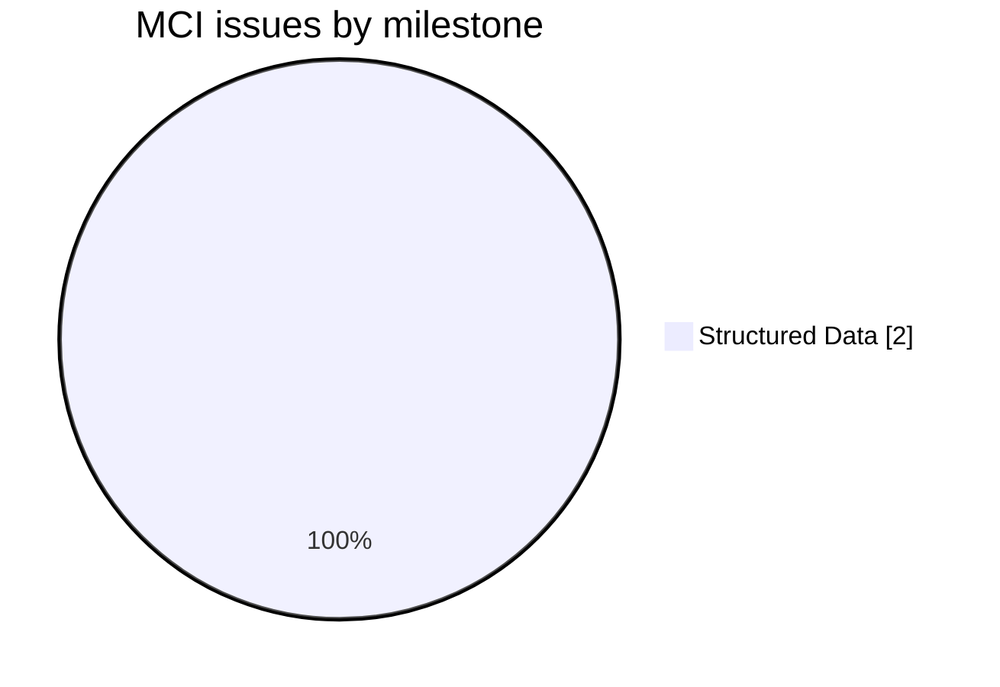
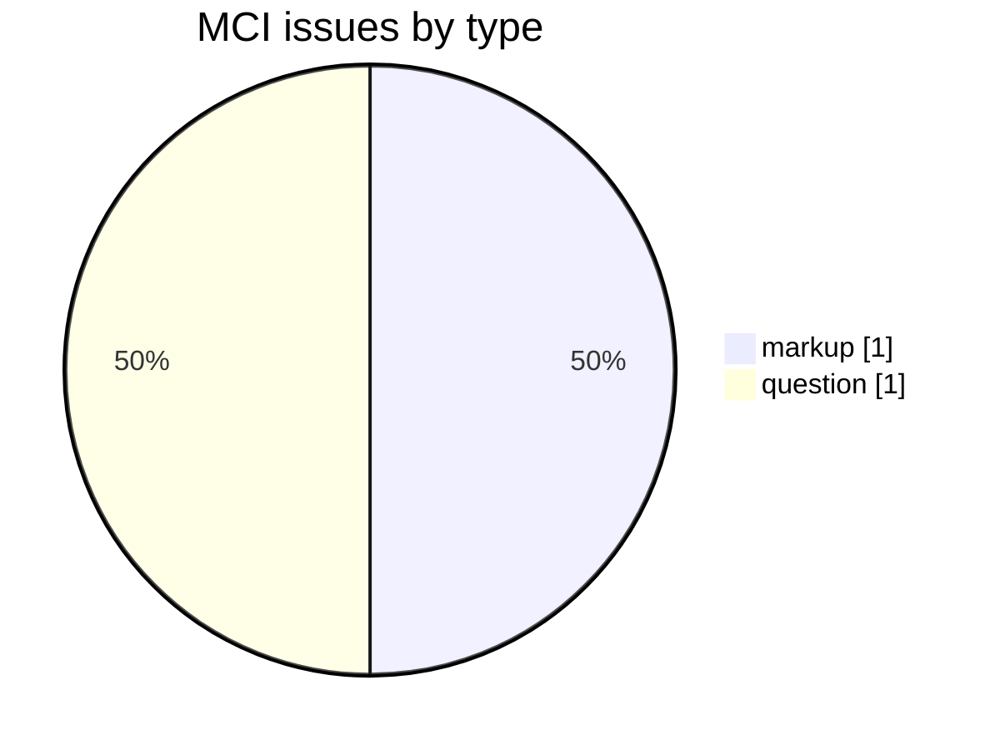

# MCI — *Mahābhārata Cultural Index* (1976–1993)

Development and correction repository for **the *Mahābhārata Cultural Index* (A. D. Pusalker et al.)**, a specialized cultural and onomastic index to the Mahābhārata, part of the [Cologne Digital Sanskrit Lexicon](https://www.sanskrit-lexicon.uni-koeln.de/) (CDSL). The canonical source text lives in [`csl-orig/v02/mci/mci.txt`](https://github.com/sanskrit-lexicon/csl-orig/blob/master/v02/mci/mci.txt) (2,325 index entries); this repository holds the development, correction, and enrichment work.

A partial, still-growing index of names and cultural references in the Mahābhārata rather than a general dictionary.

## Documentation

- [CLAUDE.md](CLAUDE.md) — repository guide and data-format reference.
- [DATA_DICTIONARY.md](DATA_DICTIONARY.md) — markup tag reference.
- [CONTRIBUTING.md](CONTRIBUTING.md) · [CODE_OF_CONDUCT.md](CODE_OF_CONDUCT.md)

## Timeline

| Period | Activity |
|---|---|
| 2014 | Repository activity begins (first tracked issues) |
| 2026-05 | Issue taxonomy, citation metadata, documentation |

## Projects & Milestones

| Milestone | Open | Closed | Total |
|---|---|---|---|
| Dictionary to Book | 0 | 0 | 0 |
| Digitization Quality | 0 | 0 | 0 |
| Structured Data | 1 | 1 | 2 |
| Major Enhancements | 0 | 0 | 0 |
| **Total** | **1** | **1** | **2** |

## Issues

### Open

| # | Title | Type | Severity | Milestone |
|---|---|---|---|---|
| 1 | Printed Book Categories Lost in OCR? | question | minor | Structured Data |

### Solved

| # | Title | Type | Severity | Milestone |
|---|---|---|---|---|
| 2 | [markup] Minor mci.txt Markup Oddities | markup | minor | Structured Data |

## Labels

### Type labels

| Label | Meaning |
|---|---|
| `link-target` | Click-throughs from `<ls>` abbreviations to scanned PDF pages |
| `link-splitting` | Splitting combined `SOURCE N,N` refs into per-page links |
| `markup` | Normalising XML tag content |
| `text-correction` | Corrections to English/Sanskrit definitions or headwords |
| `content-enhancement` | New material or structural additions beyond correction |
| `encoding` | SLP1/IAST transcoding, character normalisation |
| `scan-quality` | Replacing blurry/skewed/missing scan pages |
| `bug` | Broken links, XML errors, broken downloads |
| `question` | Scholarly questions requiring research |

### Severity labels

| Label | Meaning |
|---|---|
| `minor` | Targeted fix — a handful of lines or a single file |
| `medium` | Standard unit of work — one batch of corrections |
| `hard` | Large effort spanning many sources or files |

## Contributors

| Contributor | Commits |
|---|---|
| gasyoun (Mārcis Gasūns) | 8 |

## Source

- **Author**: Pusalker, A. D. (and others)
- **Title**: *Mahābhārata Cultural Index*
- **Place / Publisher**: Bombay: Bharatiya Vidya Bhavan
- **Year(s)**: 1976–1993
- **Volumes**: ongoing series
- **Language pair**: Sanskrit (cultural index)
- **Size (CDSL headword index)**: 2,325 index entries
- **License (digital edition)**: CC BY-SA 4.0
- See [CITATION.cff](CITATION.cff) for machine-readable citation.

## Encoding

- UTF-8 (NFC) throughout.
- Sanskrit text in SLP1 transliteration, wrapped in `{#…#}`; English gloss / italic display text in ``.
- Devanāgarī and IAST display forms are generated at display time, not stored in the source.

## How it works

---
*Issue taxonomy and documentation per the [Cologne issue runbook](https://github.com/sanskrit-lexicon/csl-observatory/blob/main/runbook/cologne-issue-runbook.md).*
